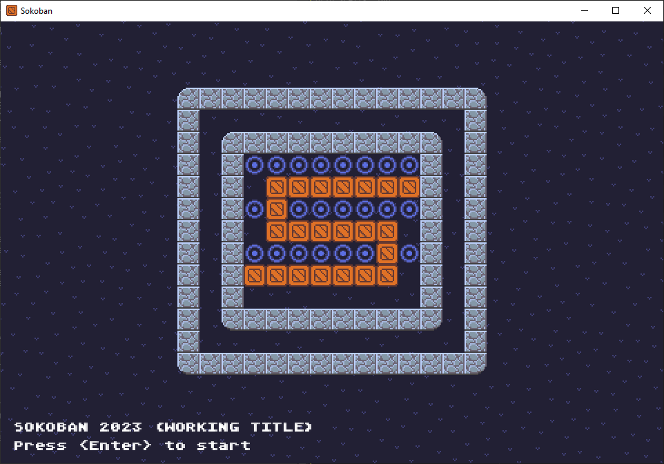

Sokoban
=======

An implementation of the puzzle game Sokoban. Includes native ports for Windows,
Linux (X11), and macOS (Intel and Apple Silicon).

Build Instructions
------------------

To build on a given platform, run the corresponding build script in the `code`
directory. Compiling on Windows requires MSVC, Linux and macOS use Clang. The
script will create a top-level `build` directory, where it will place debug and
release versions of the executable.
